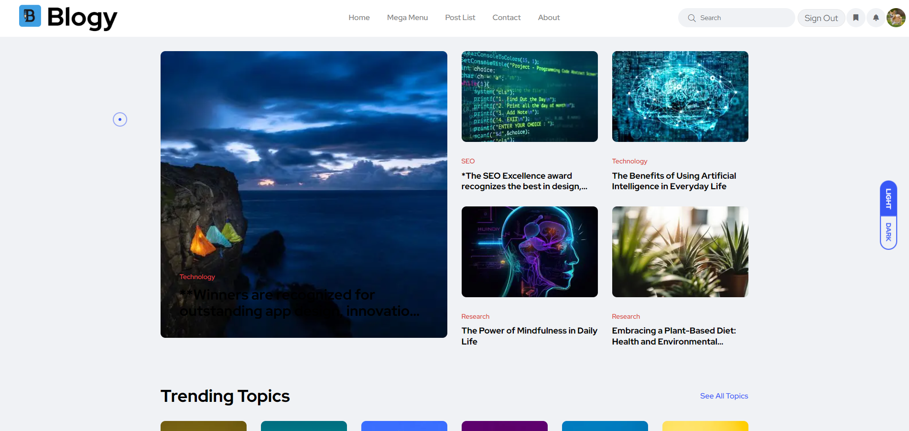
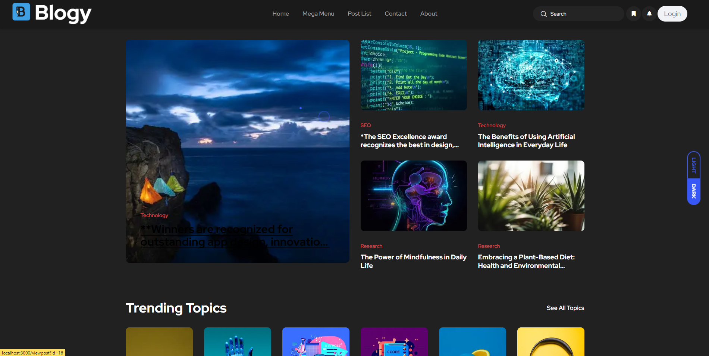
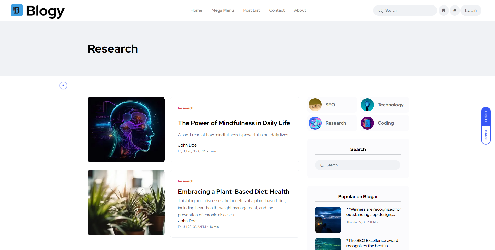
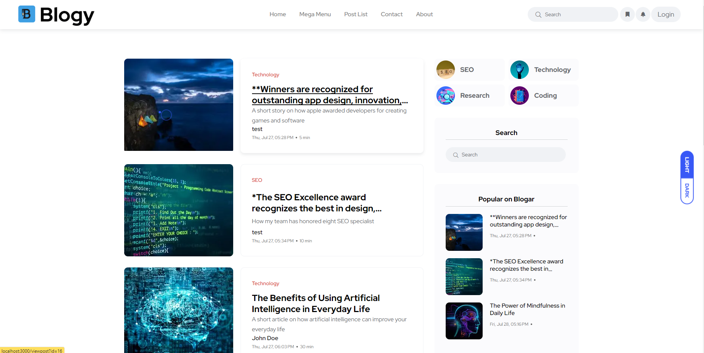

# Blogy

Blogar is a full-featured, user-friendly platform that allows users to share their stories, ideas, and perspectives. Whether you're a seasoned writer, an industry expert, or someone who enjoys sharing life experiences, Blogar provides a large and engaging community.

The landing page welcomes users with a Mega Menu that allows users to filter posts upon hover, showing the newest posts that match that category.

Upon finding a blog post of interest, users can delve deeper into the content. By clicking on a blog post, users are directed to a dedicated page showcasing the full text, accompanying images, and the author's profile. An interactive comments section at the end of each blog allows for engaging discussions and feedback.

Users are able to create their own blog posts, complete with a bold header, a large cover image in which that user can upload, and engaging content. The blogging process is streamlined and user-friendly, with a built-in post editor and a preview for what the post will look like.

With Blogar, customizing your personal profile is a breeze. You can easily update your profile picture by navigating to your user profile and selecting the pencil option. From there, users can upload a new profile picture, update their designation, and update their bio.

Experience the power of storytelling and community with Blogar. Explore our wide array of blogs, engage with confidence, and begin your blogging journey with ease.

# How It Works: Showcasing My Skills

## Server Side Rendering with Next.js

The platform I've developed utilizes Next.js, a powerful framework that enables server-side rendering (SSR). SSR significantly improves the performance and SEO of the website by rendering pages on the server before sending them to the client. This ensures faster loading times and better search engine visibility, enhancing the user experience.

## Seamless Post and Image Uploads to AWS

The platform allows users to create and upload posts effortlessly. When a user submits a post, the system seamlessly uploads the accompanying images to Amazon Web Services (AWS) S3 storage. This ensures efficient storage and quick retrieval of images for display. By utilizing AWS, the platform can handle large amounts of media content without impacting performance.

## Database Image Reference Management

To keep track of uploaded images, the platform maintains a reference in the database. This reference allows the system to link posts to their respective images without storing the actual image files in the database. By doing so, the platform efficiently manages data storage and retrieval, ensuring a well-organized and scalable system.

## Dynamic Image Processing with Sharp

As part of the image optimization strategy, the platform uses the Sharp library to create three different versions of each uploaded image: a banner image, an icon image, and a feature image. These variations are tailored to specific use cases to enhance performance and image quality.

- **Banner Image**: Used for large banners or headers, providing high-quality visuals without stretching or distorting the image.
- **Icon Image**: Ideal for small icons or thumbnails, ensuring fast loading and crisp visuals.
- **Feature Image**: Optimized for feature sections or content previews, balancing image quality and load time.

By dynamically generating and serving these image variations, the platform optimizes load times, conserves bandwidth, and delivers a smooth user experience.

## Temporary Image Links for Enhanced Security

To further enhance security and prevent unauthorized access, the platform generates temporary image links when users perform GET requests for specific images. These temporary links are valid for only a few hours, ensuring that image access is limited to authenticated users during the required timeframe.

## Profile Image Upload to AWS S3

Similar to post images, users can also upload profile images to AWS S3. This functionality provides a seamless and secure method for users to personalize their profiles. Like post images, profile images are optimized and efficiently managed to ensure optimal performance and user experience.

The platform's implementation of Next.js for SSR, seamless AWS integration for post and profile image uploads, efficient image processing with Sharp, and enhanced security measures demonstrates my skills in creating a robust and high-performance web application. With a focus on user experience and scalability, the platform provides a smooth and enjoyable environment for users to share their stories and engage with content.

## Technologies Used

- **Front-end**: HTML, SCSS, JavaScript, Next.js
- **Back-end**: Node.js, Express.js, Prisma, MySQL
- **Authentication**: bcrypt, JWT (JSON Web Tokens)
- **Other Tools**: Git, GitHub, Postman. AWS S3

## Installation

To run the project locally, follow these steps:

1. Clone the repository.
2. Install the dependencies using npm or yarn.
3. Set up the database and configure the connection.
4. Start the development server.
5. Access the website through your preferred browser.

# Pages

## Landing Page

_Figure 1: Landing Page_

The landing page greets users with a conversion-optimized design. It showcases trending topics that direct users to a search-by-category page. The displayed posts are the most recently uploaded blogs.

## Dark Landing Page

_Figure 2: Dark Landing Page_

The landing page with a dark theme applied, providing an alternative visual experience for users.

## Mega Menu

_Figure 3: Mega Menu_

Users can hover over the mega menu, which shows a quick filter by category. Upon hovering on a category, it shows 4 posts that a user can select.

## Trending Topics

_Figure 4: Trending Topics_

Users can scroll down and find a section for a search by category.

## Filter by Category

_Figure 5: Filter by Category_

Upon pressing on a topic or the red category label, a user is redirected to the category page. This page shows the most recent posts within that given category.

## All Posts

_Figure 6: All Posts_

A user can select the post list from the nav bar and view all posts.

## Top Stories

_Figure 7: Top Stories_

This section highlights the top stories or most popular posts on the platform.

## Top Stories 2

_Figure 8: Top Stories 2_

Another section highlighting top stories or most popular posts, providing users with varied content options.

## Reviews

_Figure 9: Reviews_

Users can view and interact with posts based on their reviews. This feature currently does not have functionality. I plan on updating this feature in the near future.

## My Profile

_Figure 10: My Profile_

Users can view and manage their personal profiles, including profile information and posts they have created.

## Edit Profile

_Figure 11: Edit Profile_

Users can access and modify their profile settings and information on this page. Users can edit name, designation, bio, social, and upload a profile picture.

## Create Post

_Figure 12: Create Post_

Users can access a custom post editor in which they can upload an image for their cover and edit the body of their post. As the user types, they can view a live preview of what their post will look like.

## Login

_Figure 13: Login Page_

Users can securely log in or sign up to access their accounts.

## Single Post Page

_Figure 14: Single Post Page_

Users are directed to this page when they click on a blog item. This page displays the featured image along with the title.

## Single Post Body

_Figure 15: Single Post Body_

This page displays the complete body of a single post, providing users with the full content and details of the post. This body is created using a markdown file converter, which enhances user experience and cyber security to prevent cross-site scripting.

## Post Comments

_Figure 16: Post Comments_

A user can choose to view comments and add a comment of their own.

## View Others

_Figure 17: View Others_

This page allows users to view the profiles and posts of other users on the platform.

## License

This project is licensed under the MIT License - see the [LICENSE](LICENSE) file for details.

## Credits

- Prisma: The server ORM used for handling HTTP requests and API endpoints.
- jsonwebtoken: The library used for generating and verifying JSON Web Tokens (JWT) for user authentication.
- MySQL: The relational database management system used for storing and retrieving data.
